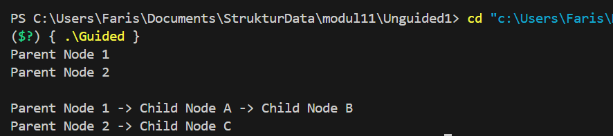
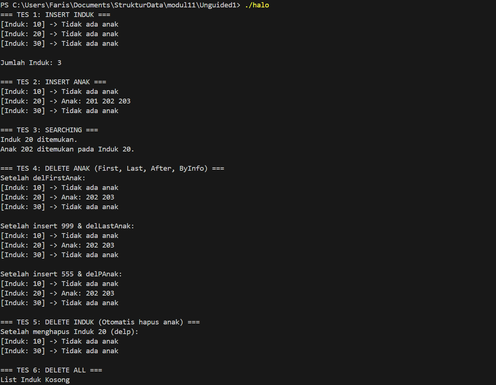
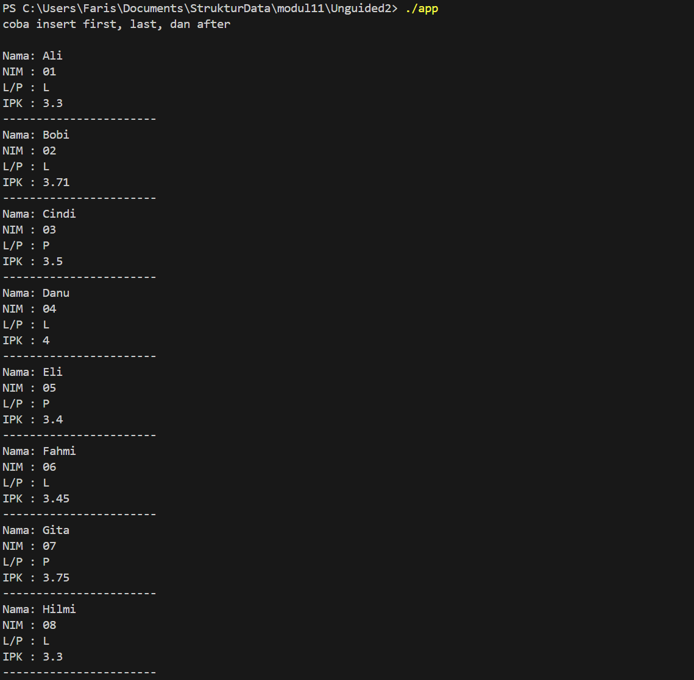

# <h1 align="center">Laporan Praktikum Modul 13 <br> MULTI LINKED LIST
<p align="center">Muhammad Faris Rachmadi - 103112400079</p>

## Dasar Teori
Multi Linked List (atau Multiple Linked List) dalam C++ adalah pengembangan struktur data senarai berantai di mana setiap node (simpul) memiliki lebih dari satu variabel pointer yang menghubungkannya ke node lain, memungkinkan representasi relasi data yang kompleks dan non-linear seperti hierarki, graf, atau hubungan parent-child (satu-ke-banyak). Secara teoritis, implementasinya menggunakan struct atau class yang menampung data serta beberapa pointer sekaligus (misalnya next untuk menunjuk ke elemen selevel dan child atau down untuk menunjuk ke sub-elemen), sehingga memungkinkan navigasi multi-dimensi dan manajemen memori dinamis yang efisien untuk mengorganisir data yang saling terkait secara bertingkat.
## Guided

### Guided 
```c++
#include <iostream>
#include <string>
using namespace std;

struct ChildNode
{
    string info;
    ChildNode *next;
};

struct ParentNode
{
    string info;
    ChildNode *childHead;
    ParentNode *next;
};

ParentNode *createParent(string info)
{
    ParentNode *newNode = new ParentNode;
    newNode->info = info;
    newNode->childHead = NULL;
    newNode->next = NULL;
    return newNode;
}

ChildNode *createChild(string info)
{
    ChildNode *newNode = new ChildNode;
    newNode->info = info;
    newNode->next = NULL;
    return newNode;
}

void insertParent(ParentNode *&head, string info)
{
    ParentNode *newNode = createParent(info);
    if (head == NULL)
    {
        head = newNode;
    }
    else
    {
        ParentNode *temp = head;
        while (temp->next != NULL)
        {
            temp = temp->next;
        }
        temp->next = newNode;
    }
}

void insertChild(ParentNode *head, string parentInfo, string childInfo)
{
    ParentNode *p = head;
    while (p != NULL && p->info != parentInfo)
    {
        p = p->next;
    }

    if (p != NULL)
    {
        ChildNode *newChild = createChild(childInfo);
        if (p->childHead == NULL)
        {
            p->childHead = newChild;
        }
        else
        {
            ChildNode *c = p->childHead;
            while (c->next != NULL)
            {
                c = c->next;
            }
            c->next = newChild;
        }
    }
}

void printAll(ParentNode *head)
{
    ParentNode *p = head;
    while (p != NULL)
    {
        cout << p->info;
        ChildNode *c = p->childHead;
        if (c != NULL)
        {
            while (c != NULL)
            {
                cout << " -> " << c->info;
                c = c->next;
            }
        }
        cout << endl;
        p = p->next;
    }
}

int main()
{
    ParentNode *list = NULL;

    insertParent(list, "Parent Node 1");
    insertParent(list, "Parent Node 2");

    printAll(list);
    cout << "\n";

    insertChild(list, "Parent Node 1", "Child Node A");
    insertChild(list, "Parent Node 1", "Child Node B");
    insertChild(list, "Parent Node 2", "Child Node C");

    printAll(list);

    return 0;
}
```
> Output
> 
> Program C++ tersebut mengimplementasikan struktur data multi linked list sederhana yang terdiri dari node induk (ParentNode) dan node anak (ChildNode), di mana setiap induk dapat memiliki daftar anak yang terhubung secara berantai. Fungsi createParent dan createChild digunakan untuk membuat node baru, sedangkan insertParent menambahkan node induk ke dalam daftar induk, dan insertChild menambahkan node anak ke induk tertentu berdasarkan informasi yang dicari. Fungsi printAll menampilkan seluruh isi daftar dengan format induk diikuti oleh anak-anaknya. Pada fungsi main, program mendemonstrasikan proses pembuatan dua node induk, kemudian menambahkan beberapa node anak ke masing-masing induk, dan akhirnya mencetak hasil struktur data yang terbentuk sehingga terlihat hubungan hierarki antara induk dan anak.
## UnGuided

## soal 2
1. Perhatikan program 46 multilist.h, buat multilist.cpp untuk implementasi semua fungsi pada 
multilist.h. Buat main.cpp untuk pemanggilan fungsi-fungsi tersebut.

## multilist.h
```c++
#ifndef MULTILIST_H_INCLUDED
#define MULTILIST_H_INCLUDED

#include <iostream>
using namespace std;

#define Nil NULL
#define info(P) (P)->info
#define next(P) (P)->next
#define prev(P) (P)->prev
#define first(L) ((L).first)
#define last(L) ((L).last)

typedef int infotypeanak;
typedef int infotypeinduk;
typedef struct elemen_list_induk *address;
typedef struct elemen_list_anak *address_anak;

struct elemen_list_anak {
    infotypeanak info;
    address_anak next;
    address_anak prev;
};

struct listanak {
    address_anak first;
    address_anak last;
};

struct elemen_list_induk {
    infotypeinduk info;
    listanak lanak; 
    address next;
    address prev;
};

struct listinduk {
    address first;
    address last;
};

void CreateList(listinduk &L);
void CreateListAnak(listanak &L);

bool ListEmpty(listinduk L);
bool ListEmptyAnak(listanak L);

address alokasi(infotypeinduk X);
address_anak alokasiAnak(infotypeanak X);
void dealokasi(address P);
void dealokasiAnak(address_anak P);

address findElm(listinduk L, infotypeinduk X);
address_anak findElmAnak(listanak L, infotypeanak X);

bool fFindElm(listinduk L, address P);
bool fFindElmAnak(listanak L, address_anak P);

address findBefore(listinduk L, address P);
address_anak findBeforeAnak(listanak L, address_anak P);

void insertFirst(listinduk &L, address P);
void insertLast(listinduk &L, address P);
void insertAfter(listinduk &L, address P, address Prec);

void insertFirstAnak(listanak &L, address_anak P);
void insertLastAnak(listanak &L, address_anak P);
void insertAfterAnak(listanak &L, address_anak P, address_anak Prec);

void delFirst(listinduk &L, address &P);
void delLast(listinduk &L, address &P);
void delAfter(listinduk &L, address &P, address Prec);
void delp(listinduk &L, infotypeinduk X);

void delFirstAnak(listanak &L, address_anak &P);
void delLastAnak(listanak &L, address_anak &P);
void delAfterAnak(listanak &L, address_anak &P, address_anak Prec);
void delPAnak(listanak &L, infotypeanak X);

void printInfo(listinduk L);
void printInfoAnak(listanak L);

int nbList(listinduk L);
int nbListAnak(listanak L);

void delAll(listinduk &L);
void delAllAnak(listanak &L);

#endif
```
## multilist.cpp
```C++
#include "multilist.h"

void CreateList(listinduk &L) {
    first(L) = Nil;
    last(L) = Nil;
}

void CreateListAnak(listanak &L) {
    first(L) = Nil;
    last(L) = Nil;
}

bool ListEmpty(listinduk L) {
    return first(L) == Nil;
}

bool ListEmptyAnak(listanak L) {
    return first(L) == Nil;
}

address alokasi(infotypeinduk X) {
    address P = new elemen_list_induk;
    info(P) = X;
    next(P) = Nil;
    prev(P) = Nil;
    CreateListAnak(P->lanak);
    return P;
}

address_anak alokasiAnak(infotypeanak X) {
    address_anak P = new elemen_list_anak;
    info(P) = X;
    next(P) = Nil;
    prev(P) = Nil;
    return P;
}

void dealokasi(address P) {
    delAllAnak(P->lanak);
    delete P;
}

void dealokasiAnak(address_anak P) {
    delete P;
}

address findElm(listinduk L, infotypeinduk X) {
    address P = first(L);
    while (P != Nil) {
        if (info(P) == X) return P;
        P = next(P);
    }
    return Nil;
}

address_anak findElmAnak(listanak L, infotypeanak X) {
    address_anak P = first(L);
    while (P != Nil) {
        if (info(P) == X) return P;
        P = next(P);
    }
    return Nil;
}

bool fFindElm(listinduk L, address P) {
    address Q = first(L);
    while (Q != Nil) {
        if (Q == P) return true;
        Q = next(Q);
    }
    return false;
}

bool fFindElmAnak(listanak L, address_anak P) {
    address_anak Q = first(L);
    while (Q != Nil) {
        if (Q == P) return true;
        Q = next(Q);
    }
    return false;
}

address findBefore(listinduk L, address P) {
    if (P == first(L)) return Nil;
    return prev(P);
}

address_anak findBeforeAnak(listanak L, address_anak P) {
    if (P == first(L)) return Nil;
    return prev(P);
}

void insertFirst(listinduk &L, address P) {
    if (ListEmpty(L)) {
        first(L) = P;
        last(L) = P;
    } else {
        next(P) = first(L);
        prev(first(L)) = P;
        first(L) = P;
    }
}

void insertLast(listinduk &L, address P) {
    if (ListEmpty(L)) {
        first(L) = P;
        last(L) = P;
    } else {
        prev(P) = last(L);
        next(last(L)) = P;
        last(L) = P;
    }
}

void insertAfter(listinduk &L, address P, address Prec) {
    next(P) = next(Prec);
    prev(P) = Prec;
    if (next(Prec) != Nil) {
        prev(next(Prec)) = P;
    } else {
        last(L) = P;
    }
    next(Prec) = P;
}

void insertFirstAnak(listanak &L, address_anak P) {
    if (ListEmptyAnak(L)) {
        first(L) = P;
        last(L) = P;
    } else {
        next(P) = first(L);
        prev(first(L)) = P;
        first(L) = P;
    }
}

void insertLastAnak(listanak &L, address_anak P) {
    if (ListEmptyAnak(L)) {
        first(L) = P;
        last(L) = P;
    } else {
        prev(P) = last(L);
        next(last(L)) = P;
        last(L) = P;
    }
}

void insertAfterAnak(listanak &L, address_anak P, address_anak Prec) {
    next(P) = next(Prec);
    prev(P) = Prec;
    if (next(Prec) != Nil) {
        prev(next(Prec)) = P;
    } else {
        last(L) = P;
    }
    next(Prec) = P;
}

void delFirst(listinduk &L, address &P) {
    if (!ListEmpty(L)) {
        P = first(L);
        if (first(L) == last(L)) {
            first(L) = Nil;
            last(L) = Nil;
        } else {
            first(L) = next(P);
            prev(first(L)) = Nil;
            next(P) = Nil;
            prev(P) = Nil;
        }
    }
}

void delLast(listinduk &L, address &P) {
     if (!ListEmpty(L)) {
        P = last(L);
        if (first(L) == last(L)) {
            first(L) = Nil;
            last(L) = Nil;
        } else {
            last(L) = prev(P);
            next(last(L)) = Nil;
            prev(P) = Nil;
            next(P) = Nil;
        }
    }
}

void delAfter(listinduk &L, address &P, address Prec) {
    P = next(Prec);
    if (P != Nil) {
        next(Prec) = next(P);
        if (next(P) != Nil) {
            prev(next(P)) = Prec;
        } else {
            last(L) = Prec;
        }
        next(P) = Nil;
        prev(P) = Nil;
    }
}

void delp(listinduk &L, infotypeinduk X) {
    address P = findElm(L, X);
    if (P != Nil) {
        if (P == first(L)) {
            delFirst(L, P);
        } else if (P == last(L)) {
            delLast(L, P);
        } else {
            address Prec = prev(P);
            delAfter(L, P, Prec);
        }
        dealokasi(P);
    }
}

void delFirstAnak(listanak &L, address_anak &P) {
    if (!ListEmptyAnak(L)) {
        P = first(L);
        if (first(L) == last(L)) {
            first(L) = Nil;
            last(L) = Nil;
        } else {
            first(L) = next(P);
            prev(first(L)) = Nil;
            next(P) = Nil;
            prev(P) = Nil;
        }
    }
}

void delLastAnak(listanak &L, address_anak &P) {
    if (!ListEmptyAnak(L)) {
        P = last(L);
        if (first(L) == last(L)) {
            first(L) = Nil;
            last(L) = Nil;
        } else {
            last(L) = prev(P);
            next(last(L)) = Nil;
            prev(P) = Nil;
            next(P) = Nil;
        }
    }
}

void delAfterAnak(listanak &L, address_anak &P, address_anak Prec) {
    P = next(Prec);
    if (P != Nil) {
        next(Prec) = next(P);
        if (next(P) != Nil) {
            prev(next(P)) = Prec;
        } else {
            last(L) = Prec;
        }
        next(P) = Nil;
        prev(P) = Nil;
    }
}

void delPAnak(listanak &L, infotypeanak X) {
    address_anak P = findElmAnak(L, X);
    if (P != Nil) {
        if (P == first(L)) {
            delFirstAnak(L, P);
        } else if (P == last(L)) {
            delLastAnak(L, P);
        } else {
            address_anak Prec = prev(P);
            delAfterAnak(L, P, Prec);
        }
        dealokasiAnak(P);
    }
}

void printInfo(listinduk L) {
    address P = first(L);
    if (ListEmpty(L)) {
        cout << "List Induk Kosong" << endl;
    } else {
        while (P != Nil) {
            cout << "[Induk: " << info(P) << "]";
            printInfoAnak(P->lanak);
            P = next(P);
        }
    }
    cout << endl;
}

void printInfoAnak(listanak L) {
    if (ListEmptyAnak(L)) {
        cout << " -> Tidak ada anak" << endl;
    } else {
        cout << " -> Anak: ";
        address_anak Q = first(L);
        while (Q != Nil) {
            cout << info(Q) << " ";
            Q = next(Q);
        }
        cout << endl;
    }
}

int nbList(listinduk L) {
    int count = 0;
    address P = first(L);
    while (P != Nil) {
        count++;
        P = next(P);
    }
    return count;
}

int nbListAnak(listanak L) {
    int count = 0;
    address_anak P = first(L);
    while (P != Nil) {
        count++;
        P = next(P);
    }
    return count;
}

void delAll(listinduk &L) {
    address P;
    while (!ListEmpty(L)) {
        delFirst(L, P);
        dealokasi(P);
    }
}

void delAllAnak(listanak &L) {
    address_anak P;
    while (!ListEmptyAnak(L)) {
        delFirstAnak(L, P);
        dealokasiAnak(P);
    }
}
```
## main.cpp
```C++
#include "multilist.h"

int main() {
    listinduk L;
    CreateList(L);
    address P, Prec, Pdel;
    address_anak A, PrecAnak, Adel;

    cout << "=== TES 1: INSERT INDUK ===" << endl;
    P = alokasi(10); insertFirst(L, P);
    P = alokasi(30); insertLast(L, P);
    Prec = findElm(L, 10);
    P = alokasi(20); insertAfter(L, P, Prec);
    printInfo(L);
    cout << "Jumlah Induk: " << nbList(L) << endl << endl;

    cout << "=== TES 2: INSERT ANAK ===" << endl;
    P = findElm(L, 20);
    if (P != Nil) {
        A = alokasiAnak(201); insertFirstAnak(P->lanak, A);
        A = alokasiAnak(203); insertLastAnak(P->lanak, A);
        PrecAnak = findElmAnak(P->lanak, 201);
        A = alokasiAnak(202); insertAfterAnak(P->lanak, A, PrecAnak);
    }
    printInfo(L);

    cout << "=== TES 3: SEARCHING ===" << endl;
    P = findElm(L, 20);
    if (P != Nil && fFindElm(L, P)) {
        cout << "Induk 20 ditemukan." << endl;
        if (findElmAnak(P->lanak, 202) != Nil) {
            cout << "Anak 202 ditemukan pada Induk 20." << endl;
        }
    }
    cout << endl;

    cout << "=== TES 4: DELETE ANAK (First, Last, After, ByInfo) ===" << endl;
    P = findElm(L, 20);
    
    delFirstAnak(P->lanak, Adel); dealokasiAnak(Adel);
    cout << "Setelah delFirstAnak:" << endl; printInfo(L);

    A = alokasiAnak(999); insertLastAnak(P->lanak, A); 
    delLastAnak(P->lanak, Adel); dealokasiAnak(Adel);
    cout << "Setelah insert 999 & delLastAnak:" << endl; printInfo(L);
    
    A = alokasiAnak(555); insertLastAnak(P->lanak, A);
    delPAnak(P->lanak, 555);
    cout << "Setelah insert 555 & delPAnak:" << endl; printInfo(L);

    cout << "=== TES 5: DELETE INDUK (Otomatis hapus anak) ===" << endl;
    delp(L, 20);
    cout << "Setelah menghapus Induk 20 (delp):" << endl;
    printInfo(L);

    cout << "=== TES 6: DELETE ALL ===" << endl;
    delAll(L);
    printInfo(L);

    return 0;
}
```
> Output
> 
> Program C++ ini mengimplementasikan struktur data Multi Linked List dengan mekanisme Doubly Linked List untuk memodelkan hubungan hierarkis antara data Pegawai (sebagai list induk) dan Anak (sebagai list anak/sub-list) . Kode ini menyediakan fungsi lengkap untuk manajemen memori dan manipulasi data, meliputi operasi alokasi, pencarian, serta penyisipan dan penghapusan elemen di berbagai posisi (awal, akhir, dan setelah elemen tertentu) pada kedua level list, dengan fitur logika khusus di mana penghapusan data pegawai akan secara otomatis memicu penghapusan seluruh data anak yang terkait untuk mencegah kebocoran memori .


### Soal 3 
Implementasikan ADT Multi Linked List dan ADT Linked List untuk studi kasus data mahasiswa (Nama, NIM, Jenis Kelamin, IPK) beserta seluruh operasi manipulasi data (insert, delete, find, print) menggunakan bahasa C++ sesuai spesifikasi header yang diberikan.

## circularlist.h
```C++
#ifndef CIRCULARLIST_H_INCLUDED
#define CIRCULARLIST_H_INCLUDED

#include <iostream>
#include <string>
using namespace std;

#define Nil NULL
#define info(P) (P)->info
#define next(P) (P)->next
#define first(L) ((L).first)

struct mahasiswa {
    string nama;
    string nim;
    char jenis_kelamin;
    float ipk;
};

typedef mahasiswa infotype;
typedef struct ElmList *address;

struct ElmList {
    infotype info;
    address next;
};

struct List {
    address first;
};

void createList(List &L);
address alokasi(infotype x);
void dealokasi(address P);

void insertFirst(List &L, address P);
void insertLast(List &L, address P);
void insertAfter(List &L, address Prec, address P);

void deleteFirst(List &L, address &P);
void deleteLast(List &L, address &P);
void deleteAfter(List &L, address Prec, address &P);

address findElm(List L, infotype x);

void printInfo(List L);

address createData(string nama, string nim, char jenis_kelamin, float ipk);

#endif
```
## circularlist.cpp
```C++
#include "circularlist.h"

void createList(List &L) {
    first(L) = Nil;
}

address alokasi(infotype x) {
    address P = new ElmList;
    info(P) = x;
    next(P) = Nil;
    return P;
}

void dealokasi(address P) {
    delete P;
}

address createData(string nama, string nim, char jenis_kelamin, float ipk) {
    infotype x;
    x.nama = nama;
    x.nim = nim;
    x.jenis_kelamin = jenis_kelamin;
    x.ipk = ipk;
    return alokasi(x);
}

void insertFirst(List &L, address P) {
    if (first(L) == Nil) {
        first(L) = P;
        next(P) = P;
    } else {
        address last = first(L);
        while (next(last) != first(L)) {
            last = next(last);
        }
        next(P) = first(L);
        next(last) = P;
        first(L) = P;
    }
}

void insertLast(List &L, address P) {
    if (first(L) == Nil) {
        first(L) = P;
        next(P) = P;
    } else {
        address last = first(L);
        while (next(last) != first(L)) {
            last = next(last);
        }
        next(last) = P;
        next(P) = first(L);
    }
}

void insertAfter(List &L, address Prec, address P) {
    if (Prec != Nil) {
        next(P) = next(Prec);
        next(Prec) = P;
    }
}

void deleteFirst(List &L, address &P) {
    if (first(L) == Nil) {
        P = Nil;
    } else if (next(first(L)) == first(L)) {
        P = first(L);
        first(L) = Nil;
    } else {
        address last = first(L);
        while (next(last) != first(L)) {
            last = next(last);
        }
        P = first(L);
        first(L) = next(P);
        next(last) = first(L);
    }
}

void deleteLast(List &L, address &P) {
    if (first(L) == Nil) {
        P = Nil;
    } else if (next(first(L)) == first(L)) {
        P = first(L);
        first(L) = Nil;
    } else {
        address last = first(L);
        address precLast = Nil;
        while (next(last) != first(L)) {
            precLast = last;
            last = next(last);
        }
        P = last;
        next(precLast) = first(L);
    }
}

void deleteAfter(List &L, address Prec, address &P) {
    if (Prec != Nil && next(Prec) != first(L)) {
         P = next(Prec);
         next(Prec) = next(P);
         next(P) = Nil;
    } else if (Prec != Nil && next(Prec) == first(L)) {
        deleteFirst(L, P);
    }
}

address findElm(List L, infotype x) {
    if (first(L) == Nil) return Nil;
    
    address P = first(L);
    do {
        if (info(P).nim == x.nim) return P;
        P = next(P);
    } while (P != first(L));
    
    return Nil;
}

void printInfo(List L) {
    if (first(L) == Nil) {
        cout << "List Kosong" << endl;
        return;
    }
    
    address P = first(L);
    do {
        cout << "Nama: " << info(P).nama << endl;
        cout << "NIM : " << info(P).nim << endl;
        cout << "L/P : " << info(P).jenis_kelamin << endl;
        cout << "IPK : " << info(P).ipk << endl;
        cout << "-----------------------" << endl;
        P = next(P);
    } while (P != first(L));
    cout << endl;
}
```
## main.cpp
```C++
#include "circularlist.h"

int main() {
    List L;
    infotype x;
    address P1 = Nil;
    address P2 = Nil;
    
    createList(L);

    cout << "coba insert first, last, dan after" << endl << endl;

    P1 = createData("Danu", "04", 'L', 4.0);
    insertFirst(L, P1);

    P1 = createData("Fahmi", "06", 'L', 3.45);
    insertLast(L, P1);

    P1 = createData("Bobi", "02", 'L', 3.71);
    insertFirst(L, P1);

    P1 = createData("Ali", "01", 'L', 3.3);
    insertFirst(L, P1);

    P1 = createData("Gita", "07", 'P', 3.75);
    insertLast(L, P1);

    P2 = createData("Cindi", "03", 'P', 3.5);
    x.nim = "02";
    P1 = findElm(L, x);
    insertAfter(L, P1, P2);

    P2 = createData("Hilmi", "08", 'L', 3.3);
    x.nim = "07";
    P1 = findElm(L, x);
    insertAfter(L, P1, P2);

    P2 = createData("Eli", "05", 'P', 3.4);
    x.nim = "04";
    P1 = findElm(L, x);
    insertAfter(L, P1, P2);

    printInfo(L);

    return 0;
}
```
> Output
> 
> Program ini menerapkan ADT Circular Single Linked List untuk mengelola data mahasiswa yang terdiri dari nama, NIM, jenis kelamin, dan IPK, di mana pointer elemen terakhir kembali menunjuk ke elemen pertama sehingga membentuk siklus tertutup . Implementasi ini mencakup 11 fungsi primitif wajib seperti pembuatan list, operasi insert dan delete (First, Last, After), serta fungsi pencarian elemen berdasarkan NIM, yang kemudian diuji dalam fungsi utama melalui skenario penyisipan data mahasiswa secara acak dan penyisipan spesifik setelah data mahasiswa lain yang ditemukan.


## Referensi

1. Modul 13: MULTI LINKED LIST [Modul Praktikum Struktur Data]. Telkom University, Bandung.
2. https://www.geeksforgeeks.org/dsa/multilevel-linked-list/
3. https://www.programiz.com/dsa/circular-linked-list


