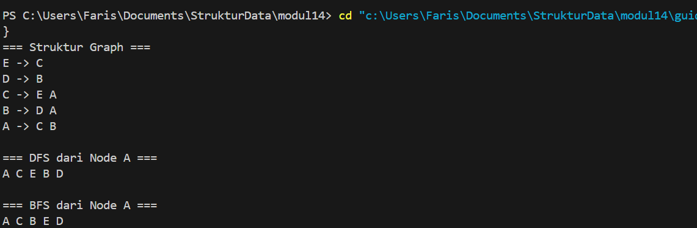
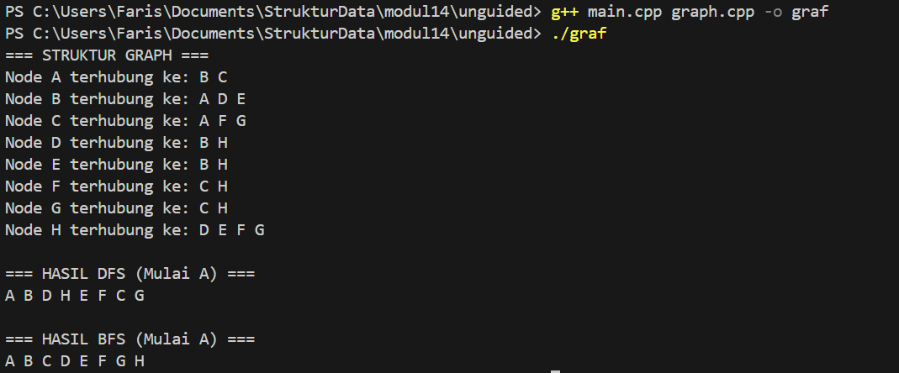

# <h1 align="center">Laporan Praktikum Modul 14 <br> Graph
<p align="center">Muhammad Faris Rachmadi - 103112400079</p>

## Dasar Teori
Graph didefinisikan sebagai himpunan tidak kosong yang terdiri dari node (vertex) dan garis penghubung (edge) , di mana hubungan antar node tersebut dapat bersifat berarah (Directed Graph) maupun tidak berarah (Undirected Graph). Dalam implementasinya, graph direpresentasikan menggunakan struktur data Multi Linked List karena sifatnya yang dinamis, di mana setiap node induk menyimpan informasi dan pointer yang menunjuk ke node anak sebagai bentuk representasi ketetanggaan atau adjacency antar simpul . Selain itu, terdapat dua metode utama untuk menelusuri elemen-elemen di dalam graph, yaitu Breadth First Search (BFS) yang melakukan kunjungan secara melebar per level kedalaman (depth) menggunakan bantuan struktur data Queue , dan Depth First Search (DFS) yang melakukan penelusuran secara mendalam ke setiap cabang subtree menggunakan prinsip Stack atau rekursi .
## Guided

### Guided 
## graf.h
```c++
#ifndef GRAF_H_INCLUDED
#define GRAF_H_INCLUDED

#include <iostream>
using namespace std;

typedef char infoGraph;

struct ElmNode;
struct ElmEdge;

typedef ElmNode *adrNode;
typedef ElmEdge *adrEdge;

struct ElmNode
{
    infoGraph info;
    int visited;
    adrEdge firstEdge;
    adrNode next;
};

struct ElmEdge
{
    adrNode node;
    adrEdge next;
};

struct Graph
{
    adrNode first;
};

// PRIMITIF GRAPH
void CreateGraph(Graph &G);
adrNode AllocateNode(infoGraph X);
adrEdge AllocateEdge(adrNode N);

void InsertNode(Graph &G, infoGraph X);
adrNode FindNode(Graph G, infoGraph X);

void ConnectNode(Graph &G, infoGraph A, infoGraph B);

void PrintInfoGraph(Graph G);

// Traversal
void ResetVisited(Graph &G);
void PrintDFS(Graph &G, adrNode N);
void PrintBFS(Graph &G, adrNode N);

#endif

```
## graf.cpp
```c++
#include "graf.h"
#include <queue>
#include <stack>

void CreateGraph(Graph &G)
{
    G.first = NULL;
}

adrNode AllocateNode(infoGraph X)
{
    adrNode P = new ElmNode;
    P->info = X;
    P->visited = 0;
    P->firstEdge = NULL;
    P->next = NULL;
    return P;
}

adrEdge AllocateEdge(adrNode N)
{
    adrEdge P = new ElmEdge;
    P->node = N;
    P->next = NULL;
    return P;
}

void InsertNode(Graph &G, infoGraph X)
{
    adrNode P = AllocateNode(X);
    P->next = G.first;
    G.first = P;
}

adrNode FindNode(Graph G, infoGraph X)
{
    adrNode P = G.first;
    while (P != NULL)
    {
        if (P->info == X)
            return P;
        P = P->next;
    }
    return NULL;
}

void ConnectNode(Graph &G, infoGraph A, infoGraph B)
{
    adrNode N1 = FindNode(G, A);
    adrNode N2 = FindNode(G, B);

    if (N1 == NULL || N2 == NULL)
    {
        cout << "Node tidak ditemukan!\n";
        return;
    }

    // Buat edge dari N1 ke N2
    adrEdge E1 = AllocateEdge(N2);
    E1->next = N1->firstEdge;
    N1->firstEdge = E1;

    // Karena undirected → buat edge balik
    adrEdge E2 = AllocateEdge(N1);
    E2->next = N2->firstEdge;
    N2->firstEdge = E2;
}

void PrintInfoGraph(Graph G)
{
    adrNode P = G.first;
    while (P != NULL)
    {
        cout << P->info << " -> ";
        adrEdge E = P->firstEdge;
        while (E != NULL)
        {
            cout << E->node->info << " ";
            E = E->next;
        }
        cout << endl;
        P = P->next;
    }
}

void ResetVisited(Graph &G)
{
    adrNode P = G.first;
    while (P != NULL)
    {
        P->visited = 0;
        P = P->next;
    }
}

void PrintDFS(Graph &G, adrNode N)
{
    if (N == NULL)
        return;

    N->visited = 1;
    cout << N->info << " ";

    adrEdge E = N->firstEdge;
    while (E != NULL)
    {
        if (E->node->visited == 0)
        {
            PrintDFS(G, E->node);
        }
        E = E->next;
    }
}

void PrintBFS(Graph &G, adrNode N)
{
    if (N == NULL)
        return;

    queue<adrNode> Q;
    Q.push(N);

    while (!Q.empty())
    {
        adrNode curr = Q.front();
        Q.pop();

        if (curr->visited == 0)
        {
            curr->visited = 1;
            cout << curr->info << " ";

            adrEdge E = curr->firstEdge;
            while (E != NULL)
            {
                if (E->node->visited == 0)
                {
                    Q.push(E->node);
                }
                E = E->next;
            }
        }
    }
}


```
## main.cpp
```c++
#include "graf.h"
#include "graf.cpp"
#include <iostream>
using namespace std;

int main()
{
    Graph G;
    CreateGraph(G);

    // Tambah node
    InsertNode(G, 'A');
    InsertNode(G, 'B');
    InsertNode(G, 'C');
    InsertNode(G, 'D');
    InsertNode(G, 'E');

    // Hubungkan node (graph tidak berarah)
    ConnectNode(G, 'A', 'B');
    ConnectNode(G, 'A', 'C');
    ConnectNode(G, 'B', 'D');
    ConnectNode(G, 'C', 'E');

    cout << "=== Struktur Graph ===\n";
    PrintInfoGraph(G);

    cout << "\n=== DFS dari Node A ===\n";
    ResetVisited(G);
    PrintDFS(G, FindNode(G, 'A'));

    cout << "\n\n=== BFS dari Node A ===\n";
    ResetVisited(G);
    PrintBFS(G, FindNode(G, 'A'));

    cout << endl;
    return 0;
}

```
> Output
> 
> program ini mengimplementasikan struktur data graf tak berarah (undirected graph) secara modular dalam bahasa C++ menggunakan representasi adjacency list, di mana graf.h mendefinisikan struktur data dasar (simpul dan sisi) serta antarmuka fungsi, sedangkan graf.cpp memuat logika operasional manipulasi graf serta algoritma penelusuran DFS (Depth-First Search) yang bekerja secara rekursif dan BFS (Breadth-First Search) yang memanfaatkan struktur data antrean (queue). Keseluruhan logika tersebut diintegrasikan dan diuji dalam main.cpp, yang berfungsi membangun topologi jaringan lima simpul (A hingga E) dengan koneksi spesifik, lalu memvisualisasikan struktur ketetanggaraan serta membandingkan hasil urutan kunjungan data dari kedua metode traversal tersebut.
## UnGuided

## soal 1
1. Buatlah ADT Graph tidak berarah file “graph.h”:
   ```pseudocode
   Type infoGraph: char 
   Type adrNode : pointer to ElmNode 
   Type adrEdge : pointer to ElmNode 
   Type ElmNode  < 
   info : infoGraph 
   visited : integer 
   firstEdge : adrEdge 
   Next : adrNode 
   > 
   Type ElmEdge  < 
   Node : adrNode 
   Next : adrEdge 
   > 
   Type Graph  < 
   first : adrNode 
   > 
   procedure CreateGraph (input/output G : Graph) 
   procedure InsertNode (input/output G : Graph,  
   input X : infotype) 
   procedure ConnectNode (input/output N1, N2 : adrNode) 
   procedure PrintInfoGraph (input G : Graph
Buatlah implementasi ADT Graph pada file “graph.cpp” dan cobalah hasil implementasi ADT 
pada file “main.cpp”.

## soal 2
2.  Buatlah prosedur untuk menampilkanhasil penelusuran DFS. prosedur PrintDFS (Graph G, adrNode N);

## soal 3
3.  Buatlah prosedur untuk menampilkanhasil penelusuran DFS. prosedur PrintBFS (Graph G, adrNode N);

## graph.h
```c++
#ifndef GRAPH_H
#define GRAPH_H

#include <iostream>
#include <queue>
using namespace std;

struct Node;

struct Edge {
    Node* tujuannya;
    Edge* next;
};

struct Node {
    char info;
    bool visited;
    Edge* firstEdge;
    Node* next;
};

struct Graph {
    Node* first;
};

void createGraph(Graph &G);
Node* buatNode(char nama);
void insertNode(Graph &G, char nama);
Node* cariNode(Graph G, char nama);
void connect(Node* asal, Node* tujuan);
void hubungkan(Node* n1, Node* n2);
void printGraph(Graph G);
void resetVisited(Graph G);
void DFS(Node* n);
void BFS(Node* n);

#endif
```
## graph.cpp
```C++
#include "graph.h"

void createGraph(Graph &G) {
    G.first = NULL;
}

Node* buatNode(char nama) {
    Node* baru = new Node;
    baru->info = nama;
    baru->visited = false;
    baru->firstEdge = NULL;
    baru->next = NULL;
    return baru;
}

void insertNode(Graph &G, char nama) {
    Node* baru = buatNode(nama);
    if (G.first == NULL) {
        G.first = baru;
    } else {
        Node* temp = G.first;
        while (temp->next != NULL) {
            temp = temp->next;
        }
        temp->next = baru;
    }
}

Node* cariNode(Graph G, char nama) {
    Node* temp = G.first;
    while (temp != NULL) {
        if (temp->info == nama) return temp;
        temp = temp->next;
    }
    return NULL;
}

void connect(Node* asal, Node* tujuan) {
    if (asal == NULL || tujuan == NULL) return;

    Edge* edgeBaru = new Edge;
    edgeBaru->tujuannya = tujuan;
    edgeBaru->next = NULL;

    if (asal->firstEdge == NULL) {
        asal->firstEdge = edgeBaru;
    } else {
        Edge* e = asal->firstEdge;
        while (e->next != NULL) e = e->next;
        e->next = edgeBaru;
    }
}

void hubungkan(Node* n1, Node* n2) {
    connect(n1, n2);
    connect(n2, n1);
}

void printGraph(Graph G) {
    Node* n = G.first;
    while (n != NULL) {
        cout << "Node " << n->info << " terhubung ke: ";
        Edge* e = n->firstEdge;
        while (e != NULL) {
            cout << e->tujuannya->info << " ";
            e = e->next;
        }
        cout << endl;
        n = n->next;
    }
}

void resetVisited(Graph G) {
    Node* n = G.first;
    while (n != NULL) {
        n->visited = false;
        n = n->next;
    }
}

void DFS(Node* n) {
    if (n == NULL || n->visited) return;

    n->visited = true;
    cout << n->info << " ";

    Edge* e = n->firstEdge;
    while (e != NULL) {
        if (!e->tujuannya->visited) {
            DFS(e->tujuannya);
        }
        e = e->next;
    }
}

void BFS(Node* n) {
    if (n == NULL) return;

    queue<Node*> q;
    q.push(n);
    n->visited = true;

    while (!q.empty()) {
        Node* sekarang = q.front();
        q.pop();
        
        cout << sekarang->info << " ";

        Edge* e = sekarang->firstEdge;
        while (e != NULL) {
            if (!e->tujuannya->visited) {
                e->tujuannya->visited = true;
                q.push(e->tujuannya);
            }
            e = e->next;
        }
    }
}
```
## main.cpp
```C++
#include "graph.h"

int main() {
    Graph G;
    createGraph(G);

    insertNode(G, 'A'); insertNode(G, 'B'); insertNode(G, 'C');
    insertNode(G, 'D'); insertNode(G, 'E'); insertNode(G, 'F');
    insertNode(G, 'G'); insertNode(G, 'H');

    Node* A = cariNode(G, 'A');
    Node* B = cariNode(G, 'B');
    Node* C = cariNode(G, 'C');
    Node* D = cariNode(G, 'D');
    Node* E = cariNode(G, 'E');
    Node* F = cariNode(G, 'F');
    Node* G_Node = cariNode(G, 'G');
    Node* H = cariNode(G, 'H');

    hubungkan(A, B); hubungkan(A, C);
    hubungkan(B, D); hubungkan(B, E);
    hubungkan(C, F); hubungkan(C, G_Node);
    hubungkan(D, H); hubungkan(E, H);
    hubungkan(F, H); hubungkan(G_Node, H);

    cout << "=== STRUKTUR GRAPH ===" << endl;
    printGraph(G);
    cout << endl;

    cout << "=== HASIL DFS (Mulai A) ===" << endl;
    resetVisited(G);
    DFS(A); 
    cout << endl << endl;

    cout << "=== HASIL BFS (Mulai A) ===" << endl;
    resetVisited(G);
    BFS(A); 
    cout << endl;

    return 0;
}
```
> Output
> 
> Program ini adalah implementasi ADT Graph tak berarah dalam bahasa C++ yang dibuat secara modular dengan tiga file: graph.h, graph.cpp, dan main.cpp. Struktur graf direpresentasikan menggunakan Adjacency List untuk menghubungkan simpul (Node) dan sisi (Edge). Fungsionalitas utama mencakup pembuatan node, penyisipan, serta penghubungan antar simpul dua arah. Program juga dilengkapi algoritma DFS (Depth First Search) dan BFS (Breadth First Search) untuk penelusuran graf, yang diuji pada graf dengan simpul A sampai H sesuai modul.


## Referensi

1. Modul 14: GRAPH [Modul Praktikum Struktur Data]. Telkom University, Bandung.
2. https://www.geeksforgeeks.org/cpp/implementation-of-graph-in-cpp/


