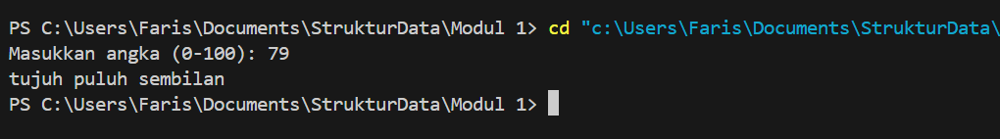
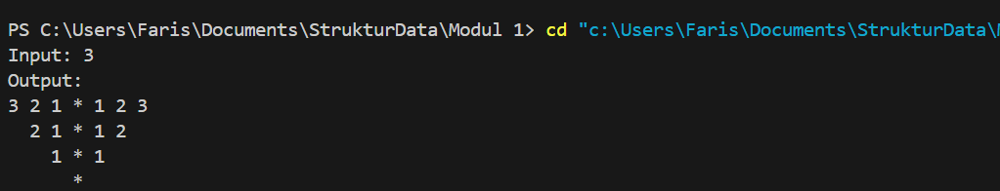

# <h1 align="center">Laporan Praktikum Modul 1 <br> CODE BLOCKS IDE & PENGENALAN BAHASA C++
<p align="center">Muhammad Faris Rachmadi - 103112400079</p>

## Dasar Teori

C++ adalah peluasan dan penyempurnaan dari bahasa pemrograman sebelumnya yaitu bahasa C, oleh Bjarne Stroustrup pada tahun 1980. Awal C++ mempunyai nama yaitu “C with Classes” dan berganti nama menjadi C++ pada tahun 1983. Bjarne Stroustrup membuat bahasa pemrograman C++ dengan tambahan fasilitas, yang sangat berguna pada tahun itu sampai sekarang, yaitu bahasa pemrograman yang mendukung OOP (Object Oriented Programming).

C++ dirancang sebagai bias terhadap sistem pemrograman dan embedded sistem, dengan mengutamakan kinerja, kecepatan, efisiensi dan fleksibilitas penggunaan. C++ telah dan sangat berguna dalam banyak hal, seperti pembuatan aplikasi desktop, server dan performance-critical (misalnya switch telepon dan pesawat luar angkasa).
## Guided

### Aritmatika
```c++
#include <iostream>
using namespace std;
int main()
{
    int W, X, Y;
    float Z;
    X = 7;
    Y = 3;
    W = 1;
    Z = (X + Y) / (Y + W);
    cout << "Nilai z = " << Z << endl;
    return 0;
}
```
> Output
> 

### Fungsi
```c++
#include <iostream>
using namespace std;

// Prosedur: hanya menampilkan hasil, tidak mengembalikan nilai
void tampilkanHasil(double p, double l)
{
    cout << "\n=== Hasil Perhitungan ===" << endl;
    cout << "Panjang : " << p << endl;
    cout << "Lebar   : " << l << endl;
    cout << "Luas    : " << p * l << endl;
    cout << "Keliling: " << 2 * (p + l) << endl;
}

// Fungsi: mengembalikan nilai luas
double hitungLuas(double p, double l)
{
    return p * l;
}

// Fungsi: mengembalikan nilai keliling
double hitungKeliling(double p, double l)
{
    return 2 * (p + l);
}

int main()
{
    double panjang, lebar;

    cout << "Masukkan panjang: ";
    cin >> panjang;
    cout << "Masukkan lebar  : ";
    cin >> lebar;

    // Panggil fungsi
    double luas = hitungLuas(panjang, lebar);
    double keliling = hitungKeliling(panjang, lebar);

    cout << "\nDihitung dengan fungsi:" << endl;
    cout << "Luas      = " << luas << endl;
    cout << "Keliling  = " << keliling << endl;

    // Panggil prosedur
    tampilkanHasil(panjang, lebar);

    return 0;
}
```
> Output
> 

Penjelasan ttg kode kalian disini

### Kondisi
```c++
#include <iostream>
using namespace std;
// int main()
// {
//     double tot_pembelian, diskon;
//     cout << "total pembelian: Rp";
//     cin >> tot_pembelian;
//     diskon = 0;
//     if (tot_pembelian >= 100000)
//         diskon = 0.05 * tot_pembelian;
//     cout << "besar diskon = Rp" << diskon;
// }

// int main()
// {
//     double tot_pembelian, diskon;
//     cout << "total pembelian: Rp";
//     cin >> tot_pembelian;
//     diskon = 0;
//     if (tot_pembelian >= 100000)
//         diskon = 0.05 * tot_pembelian;
//     else
//         diskon = 0;
//     cout << "besar diskon = Rp" << diskon;
// }

int main()
{
    int kode_hari;
    cout << "Menentukan hari kerja/libur\n"<<endl;
    cout << "1=Senin 3=Rabu 5=Jumat 7=Minggu "<<endl;
    cout << "2=Selasa 4=Kamis 6=Sabtu "<<endl;
    cin >> kode_hari;
    switch (kode_hari)
    {
    case 1:
    case 2:
    case 3:
    case 4:
    case 5:
        cout<<"Hari Kerja";
        break;
    case 6:
    case 7:
        cout<<"Hari Libur";
        break;
    default:
        cout<<"Kode masukan salah!!!";
    }
    return 0;
}
```
> Output
> 


Penjelasan ttg kode kalian disini

### Perulangan
```c++
#include <iostream>
using namespace std;
// int main()
// {
//     int jum;
//     cout << "jumlah perulangan: ";
//     cin >> jum;
//     for (int i = 0; i < jum; i++)
//     {
//         cout << "saya sahroni\n";
//     }
//     return 1;
// }


// while
int main()
{
    int i = 1;
    int jum;
    cin >> jum;
    do
    {
        cout << "bahlil ke-" << (i + 1) << endl;
        i++;
    } while (i < jum);
    return 0;
}
```
> Output
> 

Penjelasan ttg kode kalian disini

### Struct
```c++
#include <iostream>
#include <string>
using namespace std;

// Definisi struct
struct Mahasiswa {
    string nama;
    string nim;
    float ipk;
};

int main() {

    Mahasiswa mhs1;

    cout << "Masukkan Nama Mahasiswa: ";
    getline(cin, mhs1.nama);
    // cin >> mhs1.nama;
    cout << "Masukkan NIM Mahasiswa : ";
    cin >> mhs1.nim;
    cout << "Masukkan IPK Mahasiswa : ";
    cin >> mhs1.ipk;

    cout << "\n=== Data Mahasiswa ===" << endl;
    cout << "Nama : " << mhs1.nama << endl;
    cout << "NIM  : " << mhs1.nim << endl;
    cout << "IPK  : " << mhs1.ipk << endl;

    return 0;
}
```
> Output
> 


Penjelasan ttg kode kalian disini

### Test
```c++
#include <iostream>
using namespace std;
int main()
{
    string ch;
    cout << "Masukkan sebuah karakter: ";
    // cin >> ch;
    ch = getchar();  //Menggunakan getchar() untuk membaca satu karakter
    cout << "Karakter yang Anda masukkan adalah: " << ch << endl;
    return 0;
}
```
> Output
> 


Penjelasan ttg kode kalian disini

## UnGuided

### Soal 1
> 
```c++
#include <iostream>
using namespace std;

int main(){
    float x, y;

    cout << "Masukkan Bilangan Pertama: ";
    cin >> x;
    cout << "Masukkan Bilangan Kedua: ";
    cin >> y;

       cout << "\nHasil Operasi:\n";
    cout << "Penjumlahan      = " << x + y << endl;
    cout << "Pengurangan      = " << x - y << endl;
    cout << "Perkalian        = " << x * y << endl;
    cout << "Pembagian        = " << x / y << endl;

    return 0;
}
```
> Output
> 

penjelasan kode

### Soal 2
> 
```c++
#include <iostream>
using namespace std;

int main() {
    string satuan[] = {"", "satu", "dua", "tiga", "empat", "lima", 
                       "enam", "tujuh", "delapan", "sembilan"};
    string puluhan[] = {"", "sepuluh", "dua puluh", "tiga puluh", "empat puluh", 
                        "lima puluh", "enam puluh", "tujuh puluh", 
                        "delapan puluh", "sembilan puluh"};
    

    int bil;
    cout << "Masukkan angka (0-100): ";
    cin >> bil;

    if (bil == 0) cout << "nol";
    else if (bil == 10) cout << "sepuluh";
    else if (bil == 11) cout << "sebelas";
    else if (bil < 20) cout << satuan[bil - 10] << " belas";      
    else if (bil < 100) {
        cout << puluhan[bil / 10];
        if (bil % 10 != 0) cout << " " << satuan[bil % 10];       
    }
    else if (bil == 100) cout << "seratus";

    return 0;
}
```
> Output
> 

penjelasan kode

### Soal 3
> 
```c++
#include <iostream>
using namespace std;

int main() {
    int a;
    cout << "Input: ";
    cin >> a;

    cout << "Output:" << endl;
    for (int i = a; i >= 1; i--) {
        for (int s = 0; s < (a - i); s++) {
            cout << "  "; 
        }
        // kiri (turun)
        for (int j = i; j >= 1; j--) {
            cout << j << " ";
        }
        cout << "* "; 
        for (int j = 1; j <= i; j++) {
            cout << j << " ";
        }
        cout << endl;
    }

    for (int s = 0; s < a; s++) {
        cout << "  "; // spasi ganda
    }
    cout << "*" << endl;

    return 0;
}
```
> Output
> 

penjelasan kode


## Referensi

1. [https://en.wikipedia.org/wiki/Data_structure (diakses blablabla)](https://www.belajarcpp.com/tutorial/cpp/pengenalan-cpp/)
2. https://rumahcoding.co.id/pengenalan-dasar-bahasa-c-c-mulai-dari-hello-world-hingga-struktur-dasar-program/

