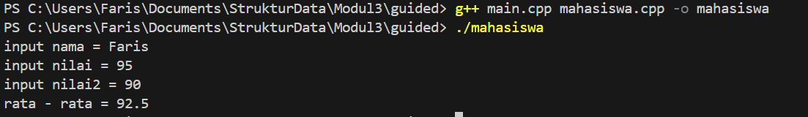
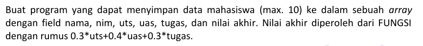
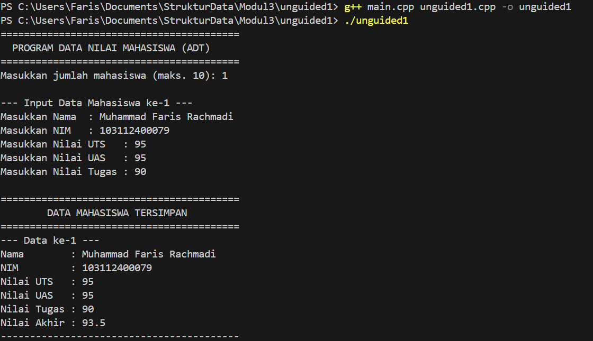
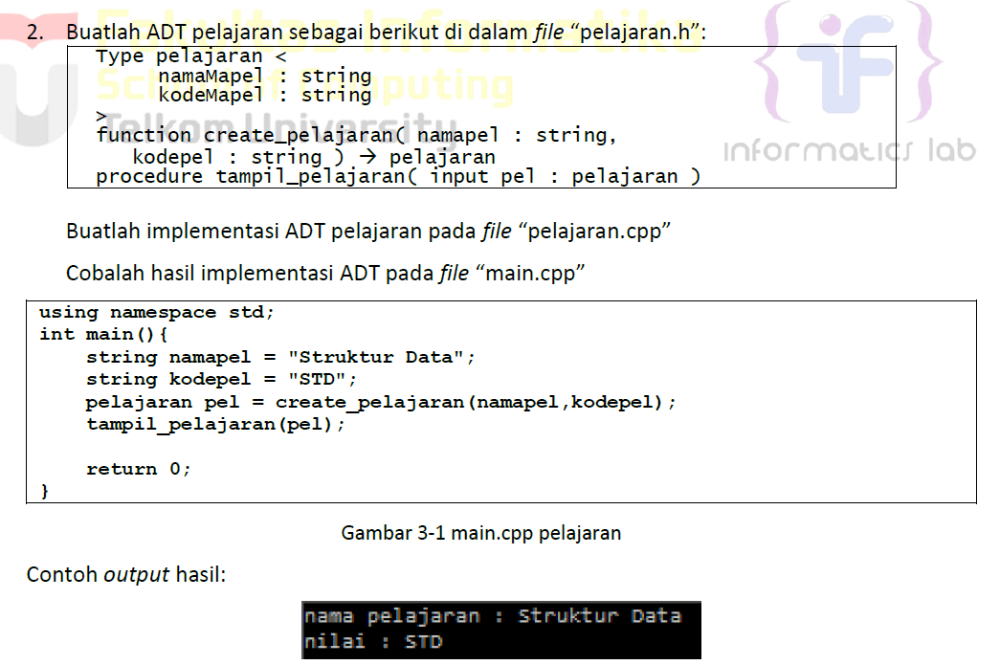
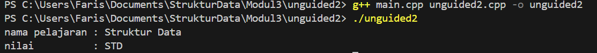
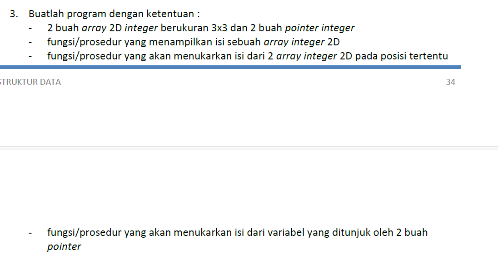
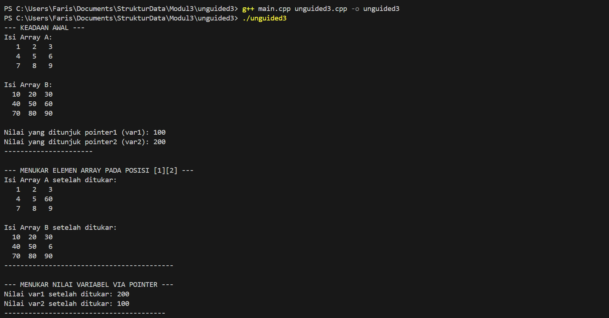

# <h1 align="center">Laporan Praktikum Modul 3 <br> ABSTRACT DATA TYPE
<p align="center">Muhammad Faris Rachmadi - 103112400079</p>

## Dasar Teori
Array

Array atau Larik adalah sebuah variabel yang memiliki serangkaian elemen dari jenis tipe data yang sama. Elemen-elemen tersebut dirangkai di dalam memori yang berdekatan dengan elemen lainya. konsep ini mirip seperti struct dan class yang dapat merupakan kumpulan dari variabel, perbedaan dengan mereka adalah array merupakan kumpulan variabel dengan satu indentifier dan satu tipe data yang sama, dan dalam istilah-istilah array kumpulan dari variabel tersebut adalah elemen.

Pointer

Setiap data atau variabel dalam sebuah program disimpan di dalam memori komputer (RAM). Memori ini bisa dibayangkan sebagai sebuah array satu dimensi yang sangat besar, di mana setiap selnya memiliki "alamat" atau "indeks" yang unik.  
Pointer adalah sebuah tipe variabel khusus yang fungsinya bukan untuk menyimpan nilai data, melainkan untuk menyimpan alamat memori dari variabel lain. Dengan kata lain, pointer ini "menunjuk" ke lokasi di mana sebuah data disimpan.
## Guided

### Mahasiswa.cpp
```c++
#include "mahasiswa.h"
#include <iostream>
using namespace std;

void inputMhs(mahasiswa &m)
{
    cout << "input nama = ";
    cin >> (m).nim;
    cout << "input nilai = ";
    cin >> (m).nilai1;
    cout << "input nilai2 = ";
    cin >> (m).nilai2;
}
float rata2(mahasiswa m)
{
    return float(m.nilai1 + m.nilai2) / 2;
}
```

### Mahasiswa.h
```c++
#ifndef MAHASISWA_H_INCLUDED
#define MAHASISWA_H_INCLUDED
struct mahasiswa
{
    char nim[10];
    int nilai1, nilai2;
};
void inputMhs(mahasiswa &m);
float rata2(mahasiswa m);
#endif
```

### Main.cpp
```c++
#include <iostream>
#include "mahasiswa.h"
using namespace std;

int main()
{
    mahasiswa mhs;
    inputMhs(mhs);
    cout << "rata - rata = " << rata2(mhs);
    return 0;
}
```
> Output
> 
> Program C++ ini berfungsi sebagai sistem pengolah data akademik sederhana. Ia menggunakan sebuah struct untuk mengemas informasi seorang mahasiswa—terdiri dari NIM dan dua nilai—menjadi satu unit yang ringkas. Alur kerjanya dimulai saat program meminta pengguna untuk memberikan data input. Data ini kemudian dilewatkan ke sebuah fungsi khusus yang bertugas menghitung rata-ratanya. Setelah kalkulasi selesai, nilai rata-rata yang dihasilkan akan langsung dicetak ke terminal sebagai output akhir


## UnGuided

### Unguided1.cpp
> 
```c++
#include <iostream>
#include "unguided1.h"

void hitungNilaiAkhir(Mahasiswa &mhs) {
    mhs.nilai_akhir = (0.3f * mhs.uts) + (0.4f * mhs.uas) + (0.3f * mhs.tugas);
}

void inputData(Mahasiswa &mhs) {
    cout << "Masukkan Nama  : ";
    getline(cin, mhs.nama);

    cout << "Masukkan NIM   : ";
    cin >> mhs.nim;

    cout << "Masukkan Nilai UTS   : ";
    cin >> mhs.uts;

    cout << "Masukkan Nilai UAS   : ";
    cin >> mhs.uas;

    cout << "Masukkan Nilai Tugas : ";
    cin >> mhs.tugas;

    //cin.ignore(1024, '\n');

    hitungNilaiAkhir(mhs);
}

void tampilData(const Mahasiswa &mhs) {
    cout << "Nama        : " << mhs.nama << endl;
    cout << "NIM         : " << mhs.nim << endl;
    cout << "Nilai UTS   : " << mhs.uts << endl;
    cout << "Nilai UAS   : " << mhs.uas << endl;
    cout << "Nilai Tugas : " << mhs.tugas << endl;
    cout << "Nilai Akhir : " << mhs.nilai_akhir << endl;
}

```

### Unguided1.h
```c++
#ifndef UNGUIDED_H
#define UNGUIDED_H

#include <string>

using namespace std;

struct Mahasiswa {
    string nama;
    string nim;
    float uts;
    float uas;
    float tugas;
    float nilai_akhir;
};

void inputData(Mahasiswa &mhs);
void hitungNilaiAkhir(Mahasiswa &mhs);
void tampilData(const Mahasiswa &mhs);

#endif
```
### Main.cpp
```c++
#include <iostream>
#include "unguided1.h"

void hitungNilaiAkhir(Mahasiswa &mhs) {
    mhs.nilai_akhir = (0.3f * mhs.uts) + (0.4f * mhs.uas) + (0.3f * mhs.tugas);
}

void inputData(Mahasiswa &mhs) {
    cout << "Masukkan Nama  : ";
    getline(cin, mhs.nama);

    cout << "Masukkan NIM   : ";
    cin >> mhs.nim;

    cout << "Masukkan Nilai UTS   : ";
    cin >> mhs.uts;

    cout << "Masukkan Nilai UAS   : ";
    cin >> mhs.uas;

    cout << "Masukkan Nilai Tugas : ";
    cin >> mhs.tugas;

    //cin.ignore(1024, '\n');

    hitungNilaiAkhir(mhs);
}

void tampilData(const Mahasiswa &mhs) {
    cout << "Nama        : " << mhs.nama << endl;
    cout << "NIM         : " << mhs.nim << endl;
    cout << "Nilai UTS   : " << mhs.uts << endl;
    cout << "Nilai UAS   : " << mhs.uas << endl;
    cout << "Nilai Tugas : " << mhs.tugas << endl;
    cout << "Nilai Akhir : " << mhs.nilai_akhir << endl;
}
```
> Output
> 
> Program C++ ini berfungsi sebagai aplikasi pendataan nilai mahasiswa yang dirancang secara modular, memungkinkan pengguna memasukkan data hingga 10 orang. Untuk setiap mahasiswa, pengguna dapat menginput informasi berupa nama, NIM, serta tiga komponen nilai: UTS, UAS, dan tugas. Sistem kemudian secara otomatis menghitung nilai akhir berdasarkan rumus pembobotan (30% UTS, 40% UAS, dan 30% tugas) segera setelah data dimasukkan. Setelah sesi input selesai, program akan menampilkan sebuah rekapitulasi lengkap yang merinci seluruh data mahasiswa yang tersimpan, beserta nilai-nilai komponen dan hasil akhir yang telah dikalkulasi.


### Unguided2.cpp
> 
```c++
#include "unguided2.h"
#include <iostream>

using namespace std;

pelajaran create_pelajaran(string nama, string kode) {
    pelajaran p;
    p.namaMapel = nama;
    p.kodeMapel = kode;
    return p;
}

void tampil_pelajaran(pelajaran pel) {
    cout << "nama pelajaran : " << pel.namaMapel << endl;
    cout << "nilai          : " << pel.kodeMapel << endl;
}
```

### Unguided2.h
```c++
#ifndef PELAJARAN_H
#define PELAJARAN_H

#include <string>

using namespace std;

struct pelajaran {
    string namaMapel;
    string kodeMapel;
};

pelajaran create_pelajaran(string nama, string kode);
void tampil_pelajaran(pelajaran pel);

#endif 
```
### Main.cpp
```c++
#include "unguided2.h"
#include <string>

using namespace std;

int main() {
    string namapel = "Struktur Data";
    string kodepel = "STD";
    
    pelajaran pel = create_pelajaran(namapel, kodepel);
    
    tampil_pelajaran(pel);
    
    return 0;
}
```
> Output
> 
> Program C++ ini mendemonstrasikan pendekatan berorientasi objek untuk mengelola data mata pelajaran menggunakan desain modular. Alur kerjanya dimulai dari file main.cpp, di mana sebuah objek bernama pel dari kelas Pelajaran dibuat. Saat objek ini dibuat, constructor kelas Pelajaran secara otomatis dipanggil untuk menginisialisasi data internalnya (nama "Struktur Data" dan kode "STD"). Setelah objek berhasil dibuat dan diinisialisasi, program kemudian memanggil member function tampilkan_info() langsung dari objek pel itu sendiri, yang bertugas untuk mencetak detail nama dan kode mata pelajaran tersebut ke layar terminal.

### Unguided3.cpp
> 
```c++
#include "unguided3.h"
#include <iostream>
#include <iomanip>

using namespace std;

void tampilArray(int arr[3][3]) {
    for (int i = 0; i < 3; ++i) {
        for (int j = 0; j < 3; ++j) {
            cout << setw(4) << arr[i][j];
        }
        cout << endl;
    }
}

void tukarElemenArray(int arrA[3][3], int arrB[3][3], int baris, int kolom) {
    if (baris >= 0 && baris < 3 && kolom >= 0 && kolom < 3) {
        int temp = arrA[baris][kolom];
        arrA[baris][kolom] = arrB[baris][kolom];
        arrB[baris][kolom] = temp;
    } else {
        cout << "Error: Posisi baris atau kolom tidak valid!" << endl;
    }
}

void tukarPointer(int* ptr1, int* ptr2) {
    int temp = *ptr1;
    *ptr1 = *ptr2;
    *ptr2 = temp;
}
```

### Unguided3.h
```c++
#ifndef OPERASI_ARRAY_H
#define OPERASI_ARRAY_H

void tampilArray(int arr[3][3]);

void tukarElemenArray(int arrA[3][3], int arrB[3][3], int baris, int kolom);

void tukarPointer(int* ptr1, int* ptr2);

#endif 
```
### Main.cpp
```c++
#include <iostream>
#include "unguided3.h"

using namespace std;

int main() {
    int arrayA[3][3] = { {1, 2, 3}, {4, 5, 6}, {7, 8, 9} };
    int arrayB[3][3] = { {10, 20, 30}, {40, 50, 60}, {70, 80, 90} };

    int var1 = 100;
    int var2 = 200;
    int* pointer1 = &var1;
    int* pointer2 = &var2;

    cout << "--- KEADAAN AWAL ---" << endl;
    cout << "Isi Array A:" << endl;
    tampilArray(arrayA);
    cout << "\nIsi Array B:" << endl;
    tampilArray(arrayB);
    cout << "\nNilai yang ditunjuk pointer1 (var1): " << *pointer1 << endl;
    cout << "Nilai yang ditunjuk pointer2 (var2): " << *pointer2 << endl;
    cout << "----------------------\n" << endl;

    int baris = 1;
    int kolom = 2;
    cout << "--- MENUKAR ELEMEN ARRAY PADA POSISI [" << baris << "][" << kolom << "] ---" << endl;
    tukarElemenArray(arrayA, arrayB, baris, kolom);
    cout << "Isi Array A setelah ditukar:" << endl;
    tampilArray(arrayA);
    cout << "\nIsi Array B setelah ditukar:" << endl;
    tampilArray(arrayB);
    cout << "------------------------------------------\n" << endl;

    cout << "--- MENUKAR NILAI VARIABEL VIA POINTER ---" << endl;
    tukarPointer(pointer1, pointer2);
    cout << "Nilai var1 setelah ditukar: " << var1 << endl;
    cout << "Nilai var2 setelah ditukar: " << var2 << endl;
    cout << "----------------------------------------\n" << endl;

    return 0;
}
```
> Output
> 
> Program C++ ini mendemonstrasikan manipulasi data dasar menggunakan array dua dimensi dan pointer dengan menerapkan desain modular yang baik. Program ini dibagi menjadi tiga file: file header (.h) untuk deklarasi fungsi, file implementasi (.cpp) untuk definisi fungsi, dan file utama (main.cpp) untuk eksekusi. Fungsi utamanya adalah untuk menampilkan, menukar elemen pada posisi tertentu antara dua array 3x3, dan menukar nilai dari dua variabel integer melalui pointer. Alur program di main menunjukkan keadaan awal data, kemudian memanggil fungsi untuk melakukan kedua jenis penukaran tersebut, dan diakhiri dengan menampilkan hasil setelah perubahan.


## Referensi

1. MODUL PRAKTIKUM STRUKTUR DATA (PENGENALAN BAHASA C++ BAGIAN 2)
2. https://www.belajarcpp.com/tutorial/cpp/array/
3. https://www.belajarcpp.com/tutorial/cpp/pointer/


