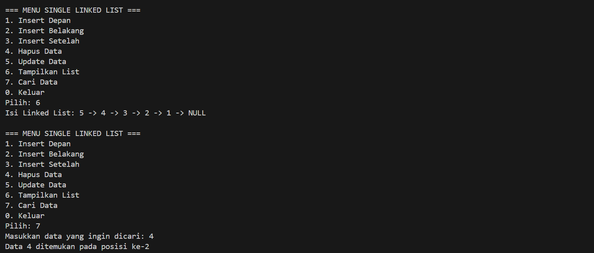
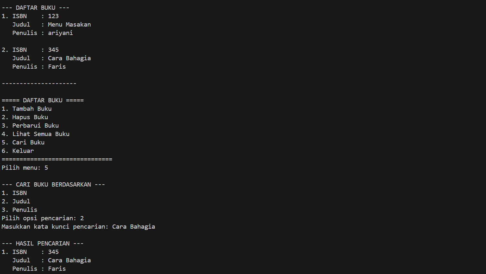

# <h1 align="center">Laporan Praktikum Modul 4 <br> SINGLY LINKED LIST (BAGIAN KEDUA)
<p align="center">Muhammad Faris Rachmadi - 103112400079</p>

## Dasar Teori

Definisi Linked List
Linked list adalah sebuah struktur data yang terdiri dari serangkaian elemen data yang saling terhubung atau berkait. Struktur ini memiliki sifat fleksibel, yang berarti ukurannya dapat bertambah (tumbuh) dan berkurang (mengerut) sesuai dengan kebutuhan program. Data yang dapat disimpan dalam elemen-elemen linked list bisa berupa data tunggal, seperti sebuah nama, atau data majemuk, yang merupakan kumpulan dari berbagai tipe data seperti data mahasiswa yang terdiri dari nama, NIM, dan alamat. Untuk mengimplementasikan linked list, pointer lebih sering digunakan dibandingkan array. Hal ini disebabkan karena sifat pointer yang dinamis, yang sangat cocok dengan karakteristik linked list yang fleksibel. Selain itu, karena elemen-elemen dalam linked list saling berhubungan, penggunaan pointer dianggap lebih mudah dan efisien. 

Singly Linked List
Singly linked list adalah salah satu model dari linked list yang paling dasar, di mana setiap elemennya hanya memiliki satu arah pointer. Setiap elemen, yang juga sering disebut sebagai node atau simpul, pada dasarnya terdiri dari dua komponen utama: 
-Data: Bagian ini berisi informasi utama yang akan disimpan dalam elemen tersebut. 
-Successor: Bagian ini adalah sebuah pointer (biasa disebut next) yang berfungsi sebagai penghubung dan menunjuk ke alamat memori dari elemen berikutnya dalam urutan list.

Searching
Searching merupakan operasi dasar list dengan melakukan aktivitas pencarian terhadap node tertentu. Proses ini berjalan dengan mengunjungi setiap node dan berhenti setelah node yang dicari ketemu. Dengan melakukan operasi searching, operasi-operasi seperti insert after, delete after, dan update akan lebih mudah. 
## Guided

### Guided 1
```c++
#include <iostream>
using namespace std;

struct Node {
    int data;
    Node* next;
};

Node* head = nullptr;

Node* createNode(int data) {
    Node* newNode = new Node();
    newNode->data = data;
    newNode->next = nullptr;
    return newNode;
}

void insertDepan(int data) {
    Node* newNode = createNode(data);
    newNode->next = head;
    head = newNode;
    cout << "Data " << data << " berhasil ditambahkan di depan.\n";
}

void insertBelakang(int data) {
    Node* newNode = createNode(data);
    if (head == nullptr) {
        head = newNode;
    } else {
        Node* temp = head;
        while (temp->next != nullptr) {
            temp = temp->next;
        }
        temp->next = newNode;
    }
    cout << "Data " << data << " berhasil ditambahkan di belakang.\n";
}

void insertSetelah(int target, int dataBaru) {
    Node* temp = head;
    while (temp != nullptr && temp->data != target) {
        temp = temp->next;
    }

    if (temp == nullptr) {
        cout << "Data " << target << " tidak ditemukan!\n";
    } else {
        Node* newNode = createNode(dataBaru);
        newNode->next = temp->next;
        temp->next = newNode;
        cout << "Data " << dataBaru << " berhasil disisipkan setelah " << target << ".\n";
    }
}

void hapusNode(int data) {
    if (head == nullptr) {
        cout << "List kosong!\n";
        return;
    }

    Node* temp = head;
    Node* prev = nullptr;

    if (temp != nullptr && temp->data == data) {
        head = temp->next;
        delete temp;
        cout << "Data " << data << " berhasil dihapus.\n";
        return;
    }

    while (temp != nullptr && temp->data != data) {
        prev = temp;
        temp = temp->next;
    }

    if (temp == nullptr) {
        cout << "Data " << data << " tidak ditemukan!\n";
        return;
    }

    prev->next = temp->next;
    delete temp;
    cout << "Data " << data << " berhasil dihapus.\n";
}

void updateNode(int dataLama, int dataBaru) {
    Node* temp = head;
    while (temp != nullptr && temp->data != dataLama) {
        temp = temp->next;
    }

    if (temp == nullptr) {
        cout << "Data " << dataLama << " tidak ditemukan!\n";
    } else {
        temp->data = dataBaru;
        cout << "Data " << dataLama << " berhasil diupdate menjadi " << dataBaru << ".\n";
    }
}

void tampilkanList() {
    if (head == nullptr) {
        cout << "List kosong!\n";
        return;
    }

    Node* temp = head;
    cout << "Isi Linked List: ";
    while (temp != nullptr) {
        cout << temp->data << " -> ";
        temp = temp->next;
    }
    cout << "NULL\n";
}

void searchData(int key) {
    Node* temp = head;
    int pos = 1;
    bool found = false;

    if (head == nullptr) {
        cout << "List kosong! Tidak ada data yang bisa dicari.\n";
        return;
    }

    while (temp != nullptr) {
        if (temp->data == key) {
            cout << "Data " << key << " ditemukan pada posisi ke-" << pos << endl;
            found = true;
            break;
        }
        temp = temp->next;
        pos++;
    }

    if (!found) {
        cout << "Data " << key << " tidak ditemukan dalam list.\n";
    }
}

int main() {
    int pilihan, data, target, dataBaru;

    do {
        cout << "\n=== MENU SINGLE LINKED LIST ===\n";
        cout << "1. Insert Depan\n";
        cout << "2. Insert Belakang\n";
        cout << "3. Insert Setelah\n";
        cout << "4. Hapus Data\n";
        cout << "5. Update Data\n";
        cout << "6. Tampilkan List\n";
        cout << "7. Cari Data\n";
        cout << "0. Keluar\n";
        cout << "Pilih: ";
        cin >> pilihan;

        switch (pilihan) {
            case 1:
                cout << "Masukkan data: ";
                cin >> data;
                insertDepan(data);
                break;
            case 2:
                cout << "Masukkan data: ";
                cin >> data;
                insertBelakang(data);
                break;
            case 3:
                cout << "Masukkan data target: ";
                cin >> target;
                cout << "Masukkan data baru: ";
                cin >> dataBaru;
                insertSetelah(target, dataBaru);
                break;
            case 4:
                cout << "Masukkan data yang ingin dihapus: ";
                cin >> data;
                hapusNode(data);
                break;
            case 5:
                cout << "Masukkan data lama: ";
                cin >> data;
                cout << "Masukkan data baru: ";
                cin >> dataBaru;
                updateNode(data, dataBaru);
                break;
            case 6:
                tampilkanList();
                break;
            case 7:
                cout << "Masukkan data yang ingin dicari: ";
                cin >> data;
                searchData(data);
                break;
            case 0:
                cout << "Program selesai. Sampai jumpa! 👋\n";
                break;
            default:
                cout << "Pilihan tidak valid!\n";
        }
    } while (pilihan != 0);

    return 0;
}
```
> Output
> 
> Program C++ ini adalah implementasi lengkap dari struktur data singly linked list (daftar tertaut tunggal) yang digunakan untuk mengelola data bilangan bulat. Program ini menyediakan fungsionalitas komprehensif untuk manipulasi list, termasuk operasi penyisipan data (di depan, di belakang, dan setelah data tertentu), penghapusan data, pembaruan (update) data, serta pencarian data. Fungsi main bertindak sebagai antarmuka pengguna berbasis menu konsol, yang menggunakan loop do-while dan switch-case untuk memungkinkan pengguna memilih operasi-operasi tersebut secara interaktif hingga pengguna memilih opsi untuk keluar.

## UnGuided

### Soal 1
> buatlah searcing untuk mencari nama pembeli pada unguided sebelumnya
```c++
##include <iostream>
#include <string>

using namespace std;

struct Node {
    string nama;
    string pesanan;
    Node* next;
};

class DaftarAntrian {
private:
    Node* depan;
    Node* belakang;

public:
    DaftarAntrian() {
        depan = nullptr;
        belakang = nullptr;
    }

    void tambah(string nama, string pesanan) {
        Node* newNode = new Node();
        newNode->nama = nama;
        newNode->pesanan = pesanan;
        newNode->next = nullptr;

        if (depan == nullptr) {
            depan = belakang = newNode;
        } else {
            belakang->next = newNode;
            belakang = newNode;
        }
        cout << "\n>> " << nama << " berhasil ditambahkan." << endl;
    }

    void layani() {
        if (depan == nullptr) {
            cout << "\n>> antrian kosong." << endl;
            return;
        }

        Node* temp = depan;
        depan = depan->next;

        if (depan == nullptr) {
            belakang = nullptr;
        }

        cout << "\n>> melayani: " << temp->nama << " (" << temp->pesanan << ")." << endl;
        delete temp;
    }

    void tampilkan() {
        cout << "\n===== daftar antrian =====" << endl;
        if (depan == nullptr) {
            cout << "      antrian kosong." << endl;
        } else {
            Node* current = depan;
            int i = 1;
            while (current != nullptr) {
                cout << i << ". " << current->nama << " - pesanan: " << current->pesanan << endl;
                current = current->next;
                i++;
            }
        }
        cout << "==========================" << endl;
    }

    void cariPembeli(string namaCari) {
        if (depan == nullptr) {
            cout << "\n>> antrian kosong, pencarian tidak dapat dilakukan." << endl;
            return;
        }

        Node* current = depan;
        bool ditemukan = false;
        int posisi = 1;

        while (current != nullptr) {
            if (current->nama == namaCari) {
                cout << "\n>> pembeli ditemukan!" << endl;
                cout << "   - posisi antrian: " << posisi << endl;
                cout << "   - nama: " << current->nama << endl;
                cout << "   - pesanan: " << current->pesanan << endl;
                ditemukan = true;
                break;
            }
            current = current->next;
            posisi++;
        }

        if (!ditemukan) {
            cout << "\n>> pembeli dengan nama '" << namaCari << "' tidak ditemukan dalam antrian." << endl;
        }
    }
};

int main() {
    DaftarAntrian antrian;
    int pilihan;
    string nama, pesanan, namaCari;

    do {
        cout << "\n\n=== menu antrian ===";
        cout << "\n1. tambah antrian";
        cout << "\n2. layani antrian";
        cout << "\n3. tampilkan antrian";
        cout << "\n4. cari pembeli";
        cout << "\n5. keluar";
        cout << "\n\npilih menu: ";
        cin >> pilihan;
        cin.ignore();

        switch (pilihan) {
            case 1:
                cout << "masukkan nama: ";
                getline(cin, nama);
                cout << "masukkan pesanan: ";
                getline(cin, pesanan);
                antrian.tambah(nama, pesanan);
                break;
            case 2:
                antrian.layani();
                break;
            case 3:
                antrian.tampilkan();
                break;
            case 4:
                cout << "masukkan nama pembeli yang ingin dicari: ";
                getline(cin, namaCari);
                antrian.cariPembeli(namaCari);
                break;
            case 5:
                cout << "\nprogram selesai." << endl;
                break;
            default:
                cout << "\n>> pilihan tidak valid." << endl;
                break;
        }
    } while (pilihan != 5);

    return 0;
}
```
> Output
> 
> Program C++ ini mengimplementasikan sistem antrian (queue) pesanan pelanggan menggunakan *linked list*. Dengan *class* `DaftarAntrian`, program ini menerapkan prinsip **First-In, First-Out melalui fungsi `tambah` (enqueue) untuk menambah data ke belakang dan `layani` (dequeue) untuk menghapus data dari depan. Program ini juga dilengkapi fungsi untuk `tampilkan` seluruh antrian dan `cariPembeli` berdasarkan nama, yang semuanya dikendalikan oleh menu interaktif di fungsi `main`.

### Soal 2
> gunakan latihan pada pertemuan minggun ini dan tambahkan seardhing untuk mencari buku berdasarkan judul, penulis, dan ISBN
```c++
#include <iostream>
#include <string>
#include <limits>

using namespace std;

struct Node {
    string isbn, judul, penulis;
    Node* next;
};

Node* head = NULL;

void tambahBuku() {
    Node* newNode = new Node();
    cout << "Masukkan ISBN: ";
    getline(cin, newNode->isbn); 
    cout << "Masukkan Judul: ";
    getline(cin, newNode->judul);
    cout << "Masukkan Penulis: ";
    getline(cin, newNode->penulis);
    newNode->next = NULL;

    if (head == NULL) {
        head = newNode;
    } else {
        Node* temp = head;
        while (temp->next != NULL) {
            temp = temp->next;
        }
        temp->next = newNode;
    }
    cout << "\n>> Buku berhasil ditambahkan!\n";
}

void lihatBuku() {
    if (head == NULL) {
        cout << "\n>> List buku masih kosong.\n";
        return;
    }

    Node* temp = head;
    int nomor = 1;
    cout << "\n--- DAFTAR BUKU ---\n";
    while (temp != NULL) {
        cout << nomor++ << ". ISBN    : " << temp->isbn << endl;
        cout << "   Judul   : " << temp->judul << endl;
        cout << "   Penulis : " << temp->penulis << endl << endl;
        temp = temp->next;
    }
    cout << "---------------------\n";
}

void hapusBuku() {
    if (head == NULL) {
        cout << "\n>> List buku kosong, tidak ada yang bisa dihapus.\n";
        return;
    }

    string isbnTarget;
    cout << "Masukkan ISBN buku yang akan dihapus: ";
    getline(cin, isbnTarget);

    Node* current = head;
    Node* prev = NULL;

    while (current != NULL && current->isbn != isbnTarget) {
        prev = current;
        current = current->next;
    }

    if (current == NULL) {
        cout << "\n>> Buku dengan ISBN " << isbnTarget << " tidak ditemukan.\n";
        return;
    }

    if (prev == NULL) {
        head = current->next;
    } else {
        prev->next = current->next;
    }

    delete current;
    cout << "\n>> Buku berhasil dihapus.\n";
}

void perbaruiBuku() {
    if (head == NULL) {
        cout << "\n>> List buku kosong.\n";
        return;
    }

    string isbnTarget;
    cout << "Masukkan ISBN buku yang akan diperbarui: ";
    getline(cin, isbnTarget);

    Node* current = head;
    while (current != NULL) {
        if (current->isbn == isbnTarget) {
            cout << "Masukkan Judul baru: ";
            getline(cin, current->judul);
            cout << "Masukkan Penulis baru: ";
            getline(cin, current->penulis);
            cout << "\n>> Data buku berhasil diperbarui!\n";
            return;
        }
        current = current->next;
    }

    cout << "\n>> Buku dengan ISBN " << isbnTarget << " tidak ditemukan.\n";
}

void cariBuku() {
    if (head == NULL) {
        cout << "\n>> List buku kosong.\n";
        return;
    }

    int pilihanCari = 0;
    string inputPilihanCari; 
    string target;
    bool ditemukan = false;
    Node* temp = head;
    int nomor = 1;

    cout << "\n--- CARI BUKU BERDASARKAN ---\n"
         << "1. ISBN\n"
         << "2. Judul\n"
         << "3. Penulis\n"
         << "Pilih opsi pencarian: ";
    
    getline(cin, inputPilihanCari);
    try {
        pilihanCari = stoi(inputPilihanCari);
    } catch (...) {
        cout << "\n>> Input tidak valid.\n";
        return;
    }

    if (pilihanCari < 1 || pilihanCari > 3) {
        cout << "\n>> Pilihan tidak valid.\n";
        return;
    }

    cout << "Masukkan kata kunci pencarian: ";
    getline(cin, target);

    cout << "\n--- HASIL PENCARIAN ---\n";

    while (temp != NULL) {
        string dataBuku;

        switch (pilihanCari) {
            case 1:
                dataBuku = temp->isbn;
                if (dataBuku == target) { 
                    ditemukan = true;
                }
                break;
            case 2:
                dataBuku = temp->judul;
                if (dataBuku.find(target) != string::npos) { 
                    ditemukan = true;
                }
                break;
            case 3:
                dataBuku = temp->penulis;
                if (dataBuku.find(target) != string::npos) {
                    ditemukan = true;
                }
                break;
        }

        if (ditemukan) {
            cout << nomor++ << ". ISBN    : " << temp->isbn << endl;
            cout << "   Judul   : " << temp->judul << endl;
            cout << "   Penulis : " << temp->penulis << endl << endl;
            ditemukan = false; 
        }
        
        temp = temp->next;
    }

    if (nomor == 1) { 
        cout << ">> Tidak ditemukan buku yang cocok dengan kata kunci \"" << target << "\".\n";
    }
    cout << "-----------------------\n";
}

int main() {
    int pilihan;
    string inputPilihan;

    do {
        cout << "\n===== DAFTAR BUKU =====\n"
             << "1. Tambah Buku\n"
             << "2. Hapus Buku\n"
             << "3. Perbarui Buku\n"
             << "4. Lihat Semua Buku\n"
             << "5. Cari Buku\n" 
             << "6. Keluar\n"
             << "===============================\n"
             << "Pilih menu: ";
        
        if (!getline(cin, inputPilihan) || inputPilihan.empty()) {
             pilihan = 0;
        } else {
            try {
                pilihan = stoi(inputPilihan);
            } catch (...) {
                pilihan = 0;
            }
        }

        switch (pilihan) {
            case 1: tambahBuku(); break;
            case 2: hapusBuku(); break;
            case 3: perbaruiBuku(); break;
            case 4: lihatBuku(); break;
            case 5: cariBuku(); break; 
            case 6: cout << "Terima kasih!\n"; break;
            default: cout << "Pilihan tidak valid!\n"; break;
        }
    } while (pilihan != 6);

    Node* current = head;
    Node* next;
    while (current != NULL) {
        next = current->next;
        delete current;
        current = next;
    }
    head = NULL;

    return 0;
}
```
> Output
> 
> Program C++ ini adalah sistem manajemen buku sederhana yang menggunakan singly linked list untuk menyimpan data (ISBN, judul, penulis). Program ini menyediakan fungsi lengkap seperti (tambah, lihat, perbarui, hapus) serta fitur cariBuku yang fleksibel, yang memungkinkan pencarian berdasarkan ISBN (tepat) atau berdasarkan judul dan penulis (sebagian). Seluruh operasi ini dijalankan melalui menu konsol interaktif dalam fungsi main.

## Referensi

1. Modul 5: Singly Linked List (Bagian Kedua) [Modul Praktikum Struktur Data]. Telkom University, Bandung.
2. https://www.tutorialspoint.com/cplusplus-program-to-implement-singly-linked-list

