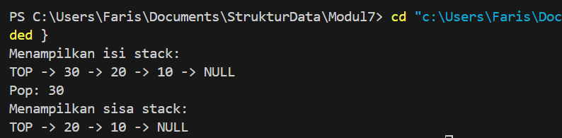
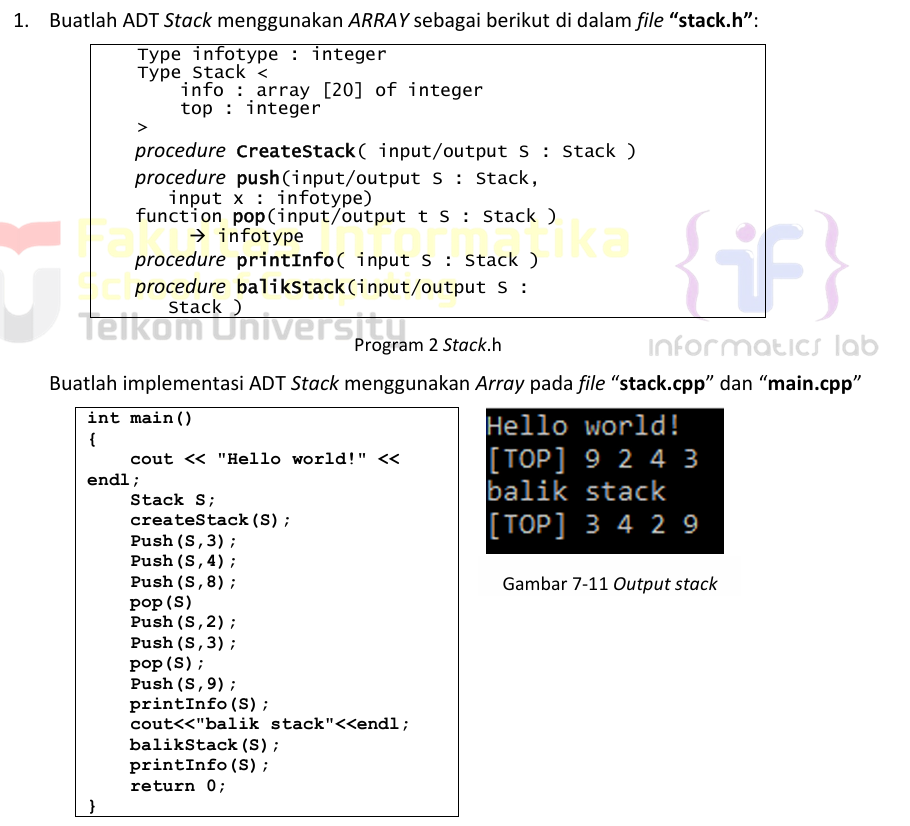
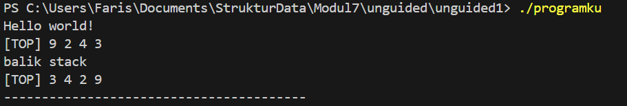
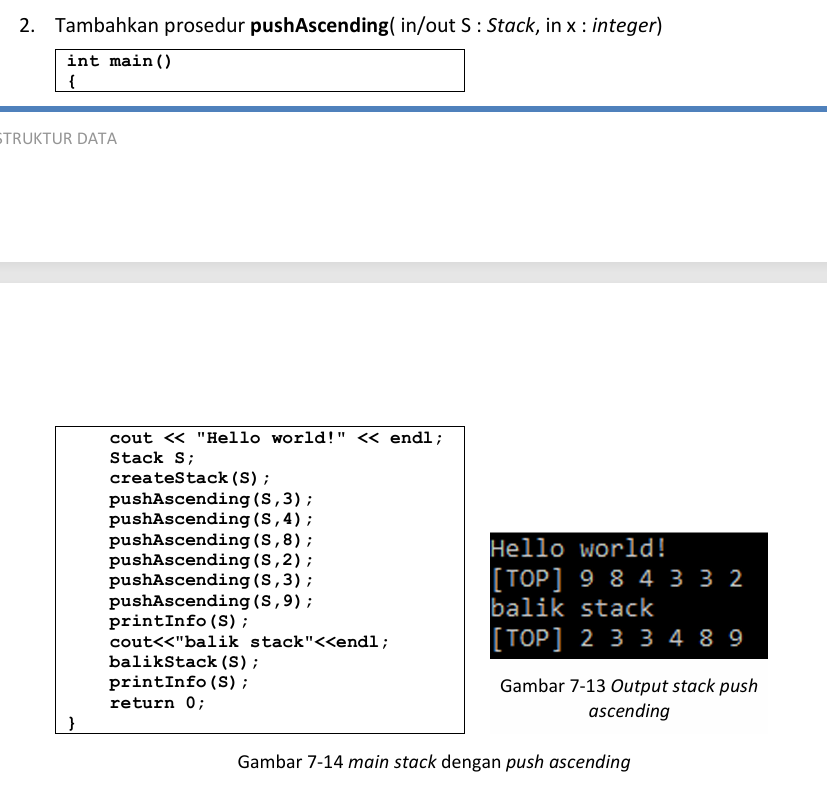
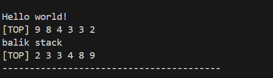
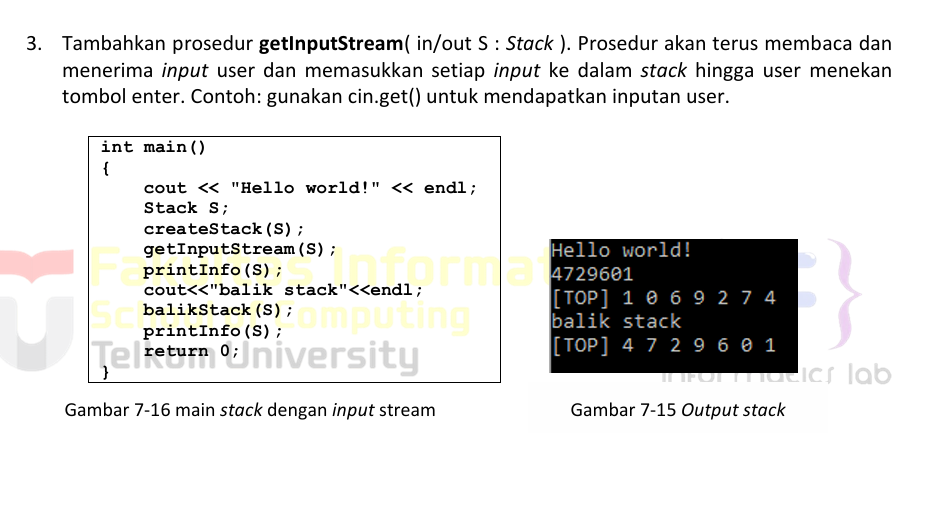
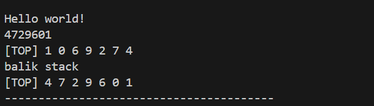

# <h1 align="center">Laporan Praktikum Modul 7 <br> STACK
<p align="center">Muhammad Faris Rachmadi - 103112400079</p>

## Dasar Teori
Stack (tumpukan) adalah salah satu bentuk struktur data linear yang menerapkan prinsip operasi seperti tumpukan benda, di mana elemen data diletakkan dan diambil hanya dari satu ujung. Prinsip fundamental yang digunakan oleh stack dikenal sebagai LIFO (Last In First Out), yang berarti elemen yang terakhir kali dimasukkan ke dalam tumpukan akan menjadi elemen yang pertama kali dikeluarkan. Akses terhadap data dalam stack bersifat terbatas dan hanya dapat dilakukan pada elemen paling awal atau paling atas, yang disebut sebagai "TOP". Terdapat dua operasi utama dalam stack: Push, yaitu operasi untuk menyisipkan atau menambahkan elemen baru ke posisi TOP (mirip dengan insert first pada list) , dan Pop, yaitu operasi untuk mengambil atau menghapus elemen yang berada di posisi TOP (mirip dengan delete first pada list).
## Guided

### Guided 1
```c++
#include <iostream>
using namespace std;

struct Node
{
    int data;
    Node *next;
};

bool isEmpty(Node *top)
{
    return top == nullptr;
}

void push(Node *&top, int data)
{
    Node *newNode = new Node();
    newNode->data = data;
    newNode->next = top;
    top = newNode;
}

int pop(Node *&top)
{
    if (isEmpty(top))
    {
        cout << "Stack kosong, tidak bisa pop!" << endl;
        return 0;
    }

    int poppedData = top->data;
    Node *temp = top;
    top = top->next;
    
    delete temp;
    return poppedData;
}

void show(Node *top)
{
    if (isEmpty(top))
    {
        cout << "Stack kosong." << endl;
        return;
    }

    cout << "TOP -> ";
    Node *temp = top;

    while (temp != nullptr)
    {
        cout << temp->data << " -> ";
        temp = temp->next;
    }

    cout << "NULL" << endl;
}

int main()
{
    Node *stack = nullptr;

    push(stack, 10);
    push(stack, 20);
    push(stack, 30);

    cout << "Menampilkan isi stack:" << endl;
    show(stack);

    cout << "Pop: " << pop(stack) << endl;

    cout << "Menampilkan sisa stack:" << endl;
    show(stack);

    return 0;
}
```
> Output
> 
> Program ini adalah implementasi struktur data stack (tumpukan) dalam C++ yang menggunakan representasi linked list dinamis. Program mendefinisikan struct Node untuk menyimpan data integer dan sebuah pointer next yang menunjuk ke node berikutnya. Terdapat empat fungsi utama: isEmpty yang memeriksa apakah pointer top menunjuk ke nullptr, push yang menambahkan elemen baru ke puncak stack dengan membuat node baru, pop yang mengambil data sekaligus menghapus node teratas (menggunakan delete untuk mencegah kebocoran memori), dan show yang mencetak isi stack dari TOP ke NULL. Fungsi main kemudian mendemonstrasikan cara kerja stack dengan menginisialisasi stack kosong, melakukan push pada angka 10, 20, dan 30, menampilkannya, lalu melakukan satu kali pop dan menampilkan sisa isi stack.
## UnGuided

### stack.h
```c++
#ifndef STACK_H
#define STACK_H

#include <iostream>

using namespace std;

const int MaxEl = 20; 

typedef int Infotype;

struct Stack {
    Infotype T[MaxEl + 1];
    int TOP;
};

#define Top(S) (S).TOP
#define InfoTop(S) (S).T[(S).TOP]

void CreateStack(Stack &S);
bool isEmpty(Stack S);
bool isFull(Stack S);
void push(Stack &S, Infotype x);
Infotype pop(Stack &S);
void printInfo(Stack S);
void balikStack(Stack &S);

void pushAscending(Stack &S, Infotype x);

void getInputStream(Stack &S);

#endif
```

### stack.cpp
```c++
#include "stack.h"

void CreateStack(Stack &S) {
    Top(S) = -1;
}

bool isEmpty(Stack S) {
    return Top(S) == -1;
}

bool isFull(Stack S) {
    return Top(S) == MaxEl;
}

void push(Stack &S, Infotype x) {
    if (!isFull(S)) {
        Top(S)++;
        InfoTop(S) = x;
    } else {
        cout << "Stack penuh" << endl;
    }
}

Infotype pop(Stack &S) {
    Infotype x;
    if (!isEmpty(S)) {
        x = InfoTop(S);
        Top(S)--;
    } else {
        x = -999; 
    }
    return x;
}

void printInfo(Stack S) {
    cout << "[TOP] ";
    if (!isEmpty(S)) {
        for (int i = Top(S); i >= 0; i--) {
            cout << S.T[i] << " ";
        }
    }
    cout << endl;
}

void balikStack(Stack &S) {
    Stack S_temp;
    CreateStack(S_temp);

    while (!isEmpty(S)) {
        push(S_temp, pop(S));
    }
    
    S = S_temp; 
}

void pushAscending(Stack &S, Infotype x) {
    Stack S_temp;
    CreateStack(S_temp);

    while (!isEmpty(S) && InfoTop(S) > x) {
        push(S_temp, pop(S));
    }
    
    push(S, x);
    
    while (!isEmpty(S_temp)) {
        push(S, pop(S_temp));
    }
}

void getInputStream(Stack &S) {
    char c;
    Infotype x;

    while ((c = cin.get()) != '\n') {
        x = c - '0'; 
        push(S, x);
    }
}
```
### main.cpp
```c++
#include "stack.h"
#include <iostream>

using namespace std;

int main() {

    cout << "Hello world!" << endl;
    
    Stack S1;
    CreateStack(S1);
    
    push(S1, 3);
    push(S1, 4);
    push(S1, 8);
    pop(S1);
    push(S1, 2);
    push(S1, 3);
    pop(S1);
    push(S1, 9);
    
    printInfo(S1);
    
    cout << "balik stack" << endl;
    balikStack(S1);
    
    printInfo(S1);
    cout << "----------------------------------------" << endl;


    cout << "\nHello world!" << endl;
    
    Stack S2;
    CreateStack(S2);
    
    pushAscending(S2, 3);
    pushAscending(S2, 4);
    pushAscending(S2, 8);
    pushAscending(S2, 2);
    pushAscending(S2, 3);
    pushAscending(S2, 9);

    printInfo(S2);
    
    cout << "balik stack" << endl;
    balikStack(S2);
    
    printInfo(S2);
    cout << "----------------------------------------" << endl;


    cout << "\nHello world!" << endl;

    Stack S3;
    CreateStack(S3);
    getInputStream(S3);
    printInfo(S3);
    
    cout << "balik stack" << endl;
    balikStack(S3);
    
    printInfo(S3);
    cout << "----------------------------------------" << endl;
    
    return 0;
}
```
### Soal 1 
> 
> Output no 1
> 

### Soal 2 
> 
> Output no 2

> 

### Soal 3
> 
> Output no 3

> 
> Program C++ ini adalah sebuah implementasi lengkap untuk struktur data Stack (tumpukan) yang dibuat menggunakan array dengan kapasitas 20 elemen. Program ini dibagi menjadi tiga file: stack.h yang mendefinisikan struktur data dan semua prototipe fungsi, stack.cpp yang berisi implementasi atau logika dari semua fungsi tersebut, dan main.cpp yang bertindak sebagai program utama. Selain menyediakan fungsi-fungsi dasar stack seperti push, pop, isEmpty, dan isFull, program ini juga menyertakan tiga fungsi khusus sesuai permintaan: balikStack untuk membalik urutan elemen di dalam stack, pushAscending untuk memasukkan elemen baru ke stack sambil menjaga urutannya tetap menaik, dan getInputStream untuk membaca serangkaian karakter angka dari input pengguna dan memasukkannya satu per satu ke dalam stack. File main.cpp kemudian menjalankan tiga skenario demo terpisah (menggunakan variabel S1, S2, dan S3) untuk menguji setiap fungsionalitas tersebut secara berurutan.


## Referensi

1. Modul 7: Stack [Modul Praktikum Struktur Data]. Telkom University, Bandung.
2. (https://www.programiz.com/cpp-programming/stack)
3. (https://www.geeksforgeeks.org/cpp/stack-implementation-in-cpp/)


